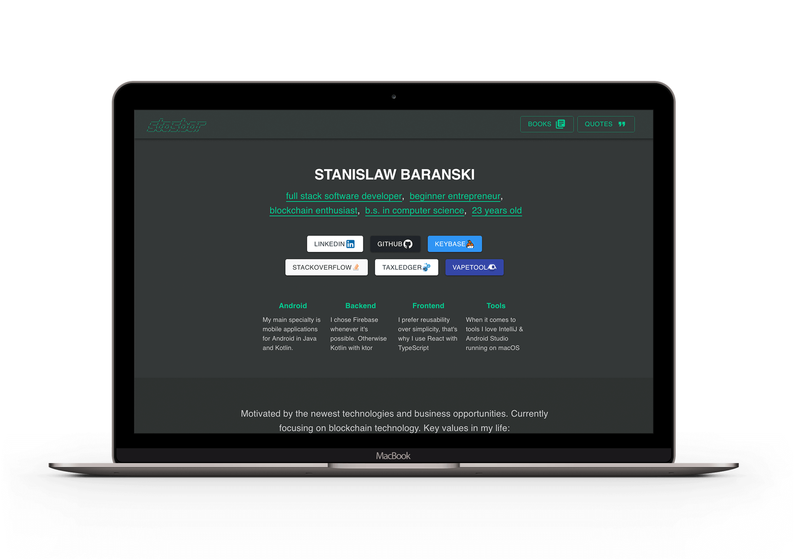
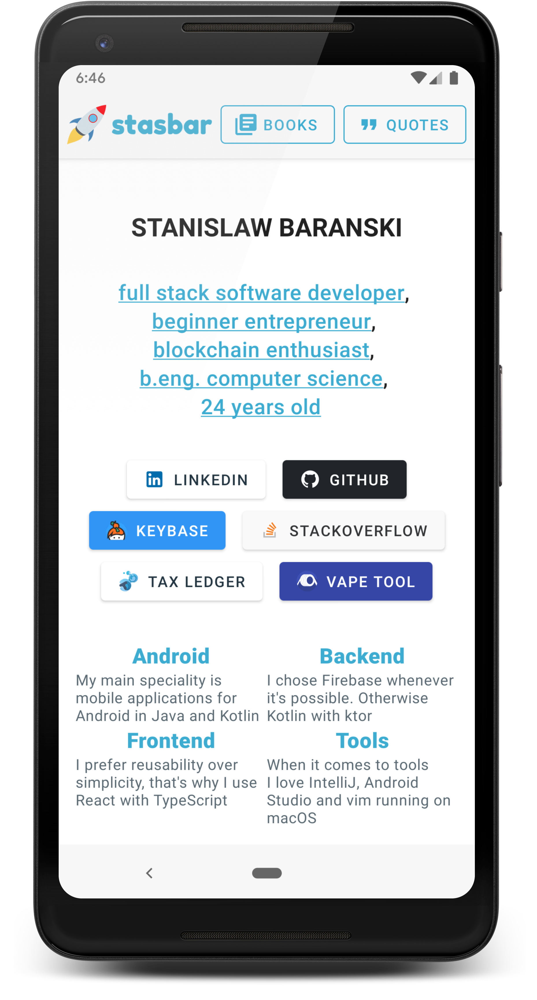
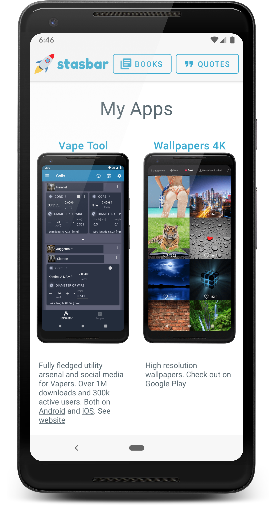

# stasbar.com

Enterprise ready, personal webpage pet project. 

| Desktop | Mobile1 | Mobile2 |
| --- | --- | --- |
|  |  |  |
### Technology Stack
<pre>
                    +-----------+Heroku+-----------+
                    | +---------|Docker+---------+ |
                    | | +-------+Backend+------+ | |
+Frontend+------+   | | |                      | | |
|               |   | | |     Kotlin/Java      | | |     +-------------+
| +Reactjs+---+ |   | | |                      | | |  +--> Google|Books|
| |TypeScript | |   | | |  +-----+Ktor+-----+  | | |  |  +-------------+
| +-----------+ +---------->                |  | | |  |
+---------------+   | | |  |                |  | | |  |  +----------+
                    | | |  |                +------------> Goodreads|
+Android+-------+   | | |  |                |  | | |  |  +----------+
|               +---------->                |  | | |  |
| +Instant+App+ |   | | |  +----------------+  | | |  |  +------------+
| |  Kotlin   | |   | | +----------------------+ | |  +--> openlibrary|
| +-----------+ |   | +--------------------------+ |     +------------+
+---------------+   |                   |          |
                    |        +-Database-v+         |
                    |        | Postgres  |         |
                    |        +-----------+         |
                    +------------------------------+

</pre>


### Backend Server
- Docker PaaS [Heroku](heroku.com)
- HTTP Server [Ktor](https://github.com/ktorio/ktor)
- HTTP Client [Retrofit](https://github.com/square/retrofit)
- Books and shelves repository from [Goodreads API](https://www.goodreads.com/api)
- Book covers from [Google Books API](https://developers.google.com/books)
- HTML DOM scraper [Jsoup](https://github.com/jhy/jsoup)
- Database [Postgres](https://www.postgresql.org/)
- ORM/DAO [Kotlin Exposed](https://github.com/JetBrains/Exposed)
- Dependency Injection [koin](https://github.com/InsertKoinIO/koin)
- Multi-threading [coroutines](https://github.com/Kotlin/kotlinx.coroutines)


### Frontend WebApp
- [TypeScript](https://www.typescriptlang.org/)
- [React](https://github.com/facebook/react)
- [Material-UI](https://material-ui.com/)


### Android Application
- [Instant App](https://developer.android.com/topic/google-play-instant/)
- HTTP Client [Retrofit](https://github.com/square/retrofit)
- Dependency Injection [koin](https://github.com/InsertKoinIO/koin)
- Multi-threading [coroutines](https://github.com/Kotlin/kotlinx.coroutines)
- [Android Arch](https://developer.android.com/topic/libraries/architecture/)


## How to build and run

### Building the code

 * Make sure you have the Android SDK installed
 * Open the project in IntelliJ IDEA
 * Create a file `local.properties` in the root directory of the project, pointing to your Android SDK installation. On Mac OS, the contents should be `sdk.dir=/Users/<your username>/Library/Android/sdk`. On other OSes, please adjust accordingly.
 * Run `./gradlew build`

### Running the backend
 * Add file `api.properties` with your Goodreads and Database credentials `GOODREADS_API_KEY`, `GOODREADS_USER_ID`, `DATABASE_USER` and `DATABASE_PASSWORD`
 * Run `./gradlew backend:run` from the command line or from Gradle tool window
 * The backend will start serving on localhost:8888

### Deploying on heroku
 * `./gradlew buildAndCopyWebapp` build webApp and copy webapp to ktor static assets  
 * `heroku container:push web` build an image and push it to Container Registry
 * `heroku container:release web` release the image to the app
or 
 * `heroku stack:set container && git push heroku master` 

### Running the Android app

 * Create a run configuration of type "Android App"
 * Select module "app" in the run configuration settings
 * Run the configuration
 * Select the emulator or connected device, as normal

### TODO

 - menu item selection mechanism [from](https://github.com/google/iosched/blob/65ac452d9c722c84480756ba6218d1062c8f2387/android/src/main/java/com/google/samples/apps/iosched/ui/BaseActivity.java)
 - redirect `stasbar.com/` to `stasbar.com/me` so it doesn't match `stasbar.com/*` pattern  

### Licences
```
Copyright 2019 Stanislaw stasbar Baranski

Licensed under the Apache License, Version 2.0 (the "License");
you may not use this file except in compliance with the License.
You may obtain a copy of the License at

   http://www.apache.org/licenses/LICENSE-2.0

Unless required by applicable law or agreed to in writing, software
distributed under the License is distributed on an "AS IS" BASIS,
WITHOUT WARRANTIES OR CONDITIONS OF ANY KIND, either express or implied.
See the License for the specific language governing permissions and
limitations under the License.


         __             __
   _____/ /_____ ______/ /_  ____ ______
  / ___/ __/ __ `/ ___/ __ \/ __ `/ ___/
 (__  ) /_/ /_/ (__  ) /_/ / /_/ / /
/____/\__/\__,_/____/_.___/\__,_/_/
           stasbar@stasbar.com
```


